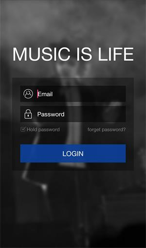
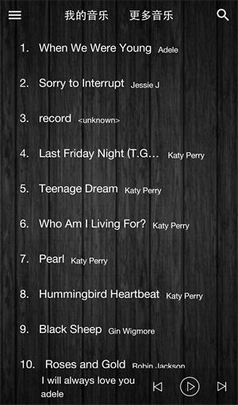

# Overview
    This project is a Audio Player, that can only play local music so far. It's developted by a indivadual developer, You are welcome to commit updates. Welcome to contact me if you have some question with this project.
    And the most important thing is the project is under development.
 
# Libraries
    In order to achieve some results we have to introduce these libraries:
 
 ### com.android.support:appcompat-v7:23.3.0
 ### com.android.support:design:23.3.0
 ### jp.wasabeef:blurry:2.0.2
    This library can make the image have a gaussian blur effect.

# Preview

#License

    Copyright 2015 Wanyt

    Licensed under the Apache License, Version 2.0 (the "License");
    you may not use this file except in compliance with the License.
    You may obtain a copy of the License at

       http://www.apache.org/licenses/LICENSE-2.0

    Unless required by applicable law or agreed to in writing, software
    distributed under the License is distributed on an "AS IS" BASIS,
    WITHOUT WARRANTIES OR CONDITIONS OF ANY KIND, either express or implied.
    See the License for the specific language governing permissions and
    limitations under the License.